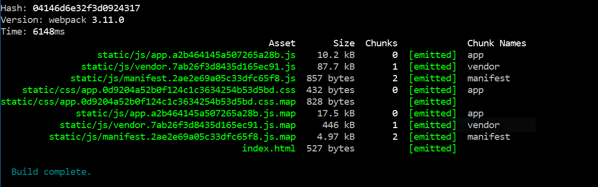

Caching is a great mechanism to reduce workload on static file servers. But if you are developing a single-page application, a misconfigured caching strategy can delay updates  or even lead to application errors.

If you have already noticed after deploying your SPA that the old version is still live, it is very likely that the caching instructions distributed with your static files are not ideal. 

Also, if you have never configured caching and rely on default settings, there are good chances that your users see updates with a non-negligible delay. Depending on your build process, they might even run a corrupted version of your application.

# How does caching works ?

Your application is composed of static files, each distributed with a caching instruction that tells your browser:

“Here is the file..

- Keep it for a day, don’t annoy me AT ALL about it until expiry” cache-control:max-age=1d(default)
- Keep it, but re-validate the file’s hash with me everytime” cache-control:no-cache
- “You better not cache it. Ask for a fresh one everytime” cache-control:no-store

This is a simplified vision of the RFC2616 specification, but it should be enough for understanding your SPA configuration. 

# What is wrong with default settings ?

The default settings for most file servers is to tell browsers to keep files in cache, for a significant period of time (with Firebase for instance the expiration period is 1 hour). 

What could go possibly wrong with this default value ?

- Best scenario: Your users see your updated application 1 hour max after release. No big deal, but it does mean that a part of your userbase will still be running the old version while the others get the new version immediately. Which may not be highly desirable.
- Worst scenario: Your users run a mix between your old application and the new one.

Let’s take the example of an application, built with Webpack, that uses filename fingerprinting.

> Filename fingerprinting is a process where the name of the file is derived from the file’s contents. It guarantees that modifying the file contents should always result in a different filename.

After building your SPA, you end up with an index.html, a few JS files, and assets (CSS, images, etc). 

As you can see, the application files app.xxxxxxxxxx.js are fingerprinted.

You may also have noticed the one file that cannot be fingerprinted: `index.html`

Its name remains the same, release after release. And this is also the file that defines your app’s dependencies. It basically tells your browser to load `app.456.js` instead of `app.123.js`.

So what is the consequence ?

When `index.html` is cached (using cache-control:max-age=1h for instance), your browser will reuse this file until expiration. It means the old version of your app will run, until index.html gets refreshed. Your users will see updates with a delay inferior or equal to the caching delay.

While it may not seem like too big of a deal, this has many side-effects. For instance, if you monitor your application for errors in real-time, critical errors might appear with a delay, since it will take time for your userbase to receive the update.

# Users might even run a corrupted version of your app

If you are not using filename fingerprinting in your build process (you should), and are telling browsers to use cache-control:max-age, some users might run **a mix between your old version and the new one**.

How is it possible ? Here is the cache of you app version 1 inside an user’s browser:

- `index.html` v1, expires in 20 min.
- `app.js` v1, expires in 10 min.
- `helpers.js` v1, expires in 20 min.

You deploy update v2, and 10 minutes later, the user navigates to the page. Here is the new state of the user’s browser:

- `index.html` still v1, because has not expired yet and was not revalidated
- `app.js` v2 because has expired and was refreshed
- `helpers.js` still v1, has not expired yet

At this point, your users run a mix of your old version and the new one. You can imagine the sort of weird cryptic bugs that will suddenly appear in your error monitoring after a new release.

Not great isn’t it ?

# How to setup reliable caching ?

Enforce `cache-control:no-cache` on `index.html`.

This will force a re-validation of index.html with the server each time you navigate to the page. If the file has not changed, the server will respond with 304 and the browser can reuse the version in cache.

If the file has changed, and your build uses filename fingerprinting, your browser will parse index.html , see inside it that new application files ( app.xxxx.js ) are required and load them. As a result, users obtains the new and healthy version of your app, immediately.

If you are not using filename fingerprinting, you should also set cache-control:no-cache to all of you files. It will ensure that your users always have an up-to-date and healthy version of your app. But **be aware that this will increase considerably the amount of requests on your file-serving provider**. You should use filename fingerprinting instead.

# Experiment

Don’t take my word for it ! Experiment. Here is a repository for playing around with  a simple VueJS app, and caching.

[cronobo/cache-busting-spa-webpack](https://github.com/cronobo/cache-busting-spa-webpack)
