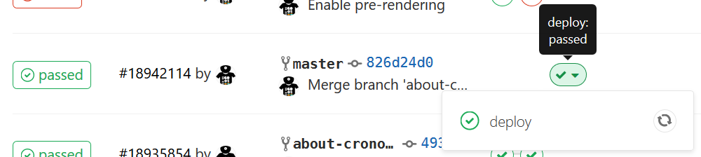

Firebase is a great solution to quickly deploy and host static files. At [Cronobo](https://cronobo.com), we use it to serve [our frontend VueJS application](https://cronobo.com).

**Note:** Some people read *static files* and immediately think about old pure-html websites, but this is not true.
If your are using an application bundler such as Webpack, after building, your single-page application becomes a set of static files. And can be hosted by Firebase.

In this article, we use [Gitlab](https://gitlab.org) to host our source code, and we will use Gitlab's continuous integration service (Gitlab-CI) to perform the deployment each time new modifications are pushed to the master branch.

# Configuring .gitlab-ci.yml for Firebase deploy

Let's start by installing firebase locally on your machine:

```
npm install -g firebase-tools
```

Let's generate a deployment token (a key to authenticate our CI script against Firebase):

```
firebase login:ci
```

The command should reply the following message:
```
+  Success! Use this token to login on a CI server:

<your FIREBASE_TOKEN should be displayed here>

Example: firebase deploy --token "$FIREBASE_TOKEN"
```

Go to Gitlab -> Settings -> CI/CD -> Secret Variables and add a new variable:

| key | value |
|-|-|
| FIREBASE_TOKEN | `YOUR FIREBASE TOKEN FROM ABOVE` |

Let's now have a look at the complete `.gitlab-ci.yml` file:

(If you don't know about this particular file, read [this](https://docs.gitlab.com/ee/ci/quick_start/README.html)).

```
stages:
  - deploy

deploy:
  image: node:8
  stage: deploy
  environment: production
  script:
    - npm install -g firebase-tools
    - firebase -V
    - cd ./dist
    - firebase deploy --token "$FIREBASE_TOKEN" -P <my-firebase-project>
  only:
    - master
```

> Here, the static files are located in the `dist` folder. If your build process generates the files elsewhere, change from `dist` accordingly.

We will review line by line what it does:

```
stages:
  - deploy
```

We first add a `deploy` stage to stages list. In Gitlab's UI this will display a new `deploy` stage like this:



```
deploy:
  image: node:8
  stage: deploy
  environment: production
```

We then start to define the stage parameters.

The root name can be called anything, what matters is the key `stage` has the same name than the one defined prior in `stages`.

The base docker image for this stage is [`node:8`](https://hub.docker.com/_/node/) NodeJS version 8.x. Basically, it means that NodeJS@8 will be available in this stage, alongside basic utilities (such as `ls`, `cd`, `bzip`, etc.).

We also define an environment, which will also appear in Gitlab's UI (CI/CD -> Environment), and helps knowing quickly what commit is live on every environment.

```
script:
  - npm install -g firebase-tools
  - firebase -V
  - cd ./dist
  - firebase deploy --token "$FIREBASE_DEPLOY_TOKEN" -P <my-firebase-project>
```

The `script` key defines what the job should do.
It starts by installing the firebase command line, and displaying its version.

Then, we move inside the folder where the static files are located, and run the `deploy` command. Once the command is done, your application will be live.

```
  only:
    - master
```

The `only` option tells gitlab to run this script only on master branch. With Git, a widely used convention is to use the master branch only for clean, production-ready code. Any features or bug-fixes should be located inside other branches, and merged to master only when they conform to the quality levels expected for production.

Using this `only` option, the website will be deployed only when a merge-request to `master` is accepted.

# Benefits

At Cronobo, our core philosophy is to automate as much as possible workflows, for our customers and of course for ourselves.

Automating application deployment is a fundamental part of our internal development process.

Automation eliminates human errors, reduces deployment time, gives developers a peculiar sense of satisfaction that once their code is reviewed and merged, it goes live without waiting for someone to perform the deployment by hands. It gives people confidence in their workflow, and capability to react quickly in case of critical issues.

# Contribute

Have some ideas for improving this script ? Feel free to modify [this gist](https://gist.github.com/Overdrivr/e3f90cabf71da10b7f30c698f3e02cbe)
