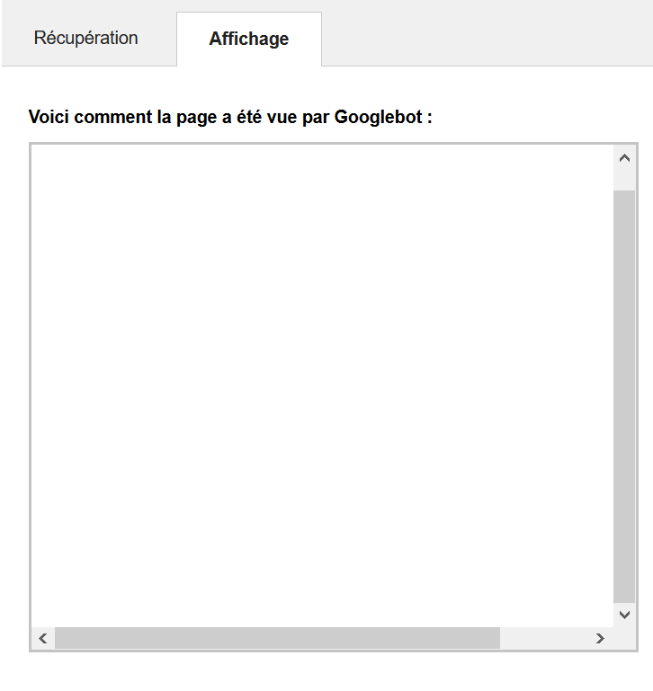

You may have read everywhere that Google's index bots can now run javascript. In theory, it means that single-page applications built with VueJS or Angular should be rendered correctly by Google bots.

The truth is a bit more complicated.

# How indexing bots see your VueJS app in 2018

In Google's search console, there is a tool called `Explore like Google` that shows you how Google's indexing bots see your website.

Here is how a Vue app looks like:



Nothing. The void.

A quick look at the HTML code that was read by Google reveals that the VueJS app is seen before it could render the page:

```html
<body>
  <div id="app"></div>
</body>
```

Only the base tag `<div id="app"></div>` is there, and Vue did not have the time to replace it with the actual page's contents.

Time is the key factor here.

Basically, Google sees your VueJS app **before** it could be rendered. So yes it can execute javascript, but it looks like it's killing the page before Vue can perform its rendering. And we end up with an empty page.

As you can guess, the SEO for this app is not going to kick ass.

# Fixing this with pre-rendering + Gitlab-CI

At [cronobo](https://cronobo.com/enterprise), one of the solutions we setup for our customers is called pre-rendering. It consists in rendering specific routes of the Vue application that contains mostly static content, i.e. pages that stay the same once the initial rendering has been completed, and don't display any user data.

And because we are [specialized in software automation](https://cronobo.com/enterprise), let's automate this whole thing using Gitlab-CI !

Pre-rendering:
- occurs at build time
- can be setup with almost zero effort
- and zero infrastructure changes

So why bother not to ?

If you have pages in your application that are relevant for SEO, such as a landing page or documentation, pre-rendering them is ideal.

If you are using VueJS with webpack (possibly generated by [vue-cli](https://github.com/vuejs/vue-cli)), this tutorial is for you.

We are going to use the [prerender-spa-plugin](https://www.npmjs.com/package/prerender-spa-plugin) module to take care of prerendering specific routes.

## 1. Install the plugin

```
npm install --save-dev prerender-spa-plugin@next
```

## 2. Configure webpack build

Open `build/webpack.prod.conf.js` in your project, and add the following code:

```
const PrerenderSpaPlugin = require('prerender-spa-plugin')

const buildFolder = path.resolve(__dirname, '../dist')

const routesToPrerender = [ '/', '/about', '/enterprise' ]

const webpackConfig = merge(baseWebpackConfig, {
  //...
  plugins: [
    //...
    new PrerenderSpaPlugin(
      buildFolder,
      routesToPrerender,
    ),
```

Modify `routesToPrerender` with the VueJS routes that you want to pre-render.

If needed, change `buildFolder` to the folder where webpacks places your built files (in my case it's './dist')

## 3. Configure Gitlab-CI

Open `.gitlab-ci.yml` file inside your project repository (or create it), and add the following contents below.

```
stages:
  - build

build:
  image: cronobo/node-chrome-headless-puppeteer
  stage: build
  script:
    - npm install
    - npm run build
    - cp -R ./dist ./public
  artifacts:
    paths:
      - public
```

This build stage simply runs the webpack build, copies the generated files (with the pre-rendered routes in them) from the `./dist` folder to `./public` folder.

The public folder is defined as `artifacts` so that it's contents are saved, and other stages can access the generated files. It is pretty convenient if you want to deploy your application inside another stage.

The only trick part is to use a docker image that contains headless chrome and puppeteer to control it.  We have created a docker image that does just that:
 [`cronobo/node-chrome-headless-puppeteer`](https://hub.docker.com/r/cronobo/node-chrome-headless-puppeteer/) ([github](https://github.com/cronobo/node-chrome-headless-puppeteer))

Now, this `gitlab-ci.yml` only pre-renders routes but you still need to deploy your application afterwards. If you don't know how to do it, have a look at [our article](https://blog.cronobo.com/2018/03/22/deploy-firebase-from-gitlab-ci.html) that covers this!

# The result

Then:
1. Commit your files
2. Push to Gitlab
3. Go to Google's search console
4. Request a new exploration of any of your pre-rendered routes
5. And observe the result !


# Conclusion

Pre-rendering is an excellent technique to dramatically improve SEO for a single-page application.
Also, do not think that a pre-rendered page is static. It still contains all the logic that you have implemented in Vue.

Unlike Server-Side Rendering, pre-render can be achieved at no cost, without much effort, and will improve dramatically your SEO indexing.
